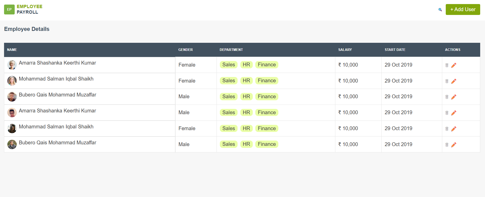

# 🧾 Employee Payroll Management UI

A clean and responsive **Employee Payroll Management UI** built using **HTML, CSS, and Bootstrap**.  
This project includes an employee listing page and an add-employee form with a consistent design, smooth hover effects, and responsive layout.

---

## 📸 Preview

> Add your UI screenshot below 👇

> 📌 Replace the image path with your own screenshot location.

---

## 🚀 Features

- ✅ Responsive Employee List Table  
- ✅ Add Employee Form (large & professional layout)  
- ✅ Same CSS used across all pages  
- ✅ Smooth hover animation on **Add User** button  
- ✅ Mobile, Tablet & Desktop friendly  
- ✅ Clean UI with consistent color theme  

---

## 🛠️ Tech Stack

- **HTML5**
- **CSS3**
- **Bootstrap 5 (for layout & responsiveness only)**

---

## 📁 Project Structure

