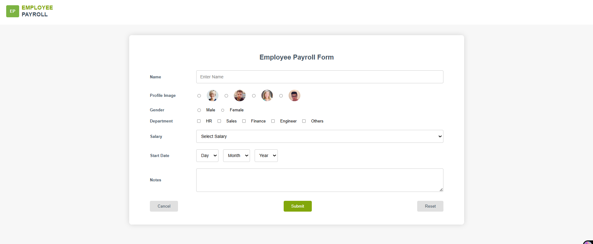
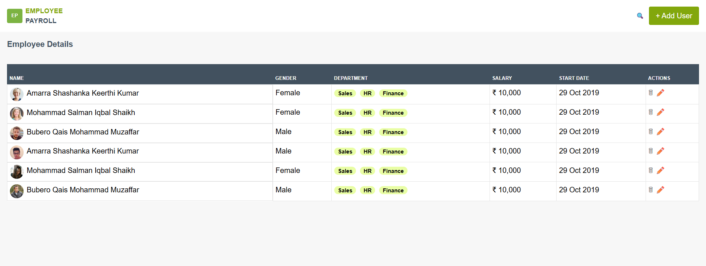

# 🧾 Employee Payroll Management UI

A clean and responsive **Employee Payroll Management UI** built using **HTML, CSS, Bootstrap, and JavaScript**.  
This project allows users to **add, update, delete, search, and manage employee payroll records** with data persistence using **LocalStorage** and optional **REST API integration**.

---

## 📸 Preview

> Add your UI screenshot below 👇


> 📌 Replace the image path with your own screenshot location.

---

## 🚀 Features

- ✅ Responsive Employee List Table  
- ✅ Add Employee Form (large & professional layout)  
- ✅ Same CSS used across all pages  
- ✅ Smooth hover animation on **Add User** button  
- ✅ Mobile, Tablet & Desktop friendly  
- ✅ Clean UI with consistent color theme  

---

## 🛠️ Tech Stack

- **HTML5**
- **CSS3**
- **Bootstrap 5** (for layout & responsiveness)
- **JavaScript (Vanilla JS)**

---

## 📁 Project Structure

  


---

## 🆕 Newly Implemented Functionalities

### 👤 Employee Management
- Add new employee with:
  - Name  
  - Gender  
  - Profile Image  
  - Department(s)  
  - Salary (formatted in ₹ INR style)  
  - Joining Date  
- Update existing employee details  
- Delete employee records with confirmation prompt  

---

### 💾 Data Persistence
- Employee data stored using **LocalStorage**
- Supports **Edit Mode** using stored index
- Data remains safe even after page reload

---

### 🔍 Search Functionality
- Search employees by:
  - Employee Name
  - Department
- Real-time filtering as user types

---

### 📝 Form Validation
- Name validation
- Gender selection required
- Profile image selection required
- At least one department must be selected
- Salary field validation
- Joining date validation (Day / Month / Year)

---

### 🔄 Edit & Update Flow
- Click ✏️ icon to edit employee
- Form auto-fills with existing data
- Data updates correctly in LocalStorage
- User redirected back to listing page after update

---

### 🌐 Backend API Integration (Optional)
- Integrated with **JSON Server**
- Supports:
  - `POST` → Add Employee
  - `PUT` → Update Employee
  - `DELETE` → Remove Employee
- API Endpoints:
  - `http://localhost:3000/employees`

---

## 📌 How to Run the Project

1. Clone the repository  
   ```bash
   git clone <https://github.com/Divyansh230/Employee_Payroll>
